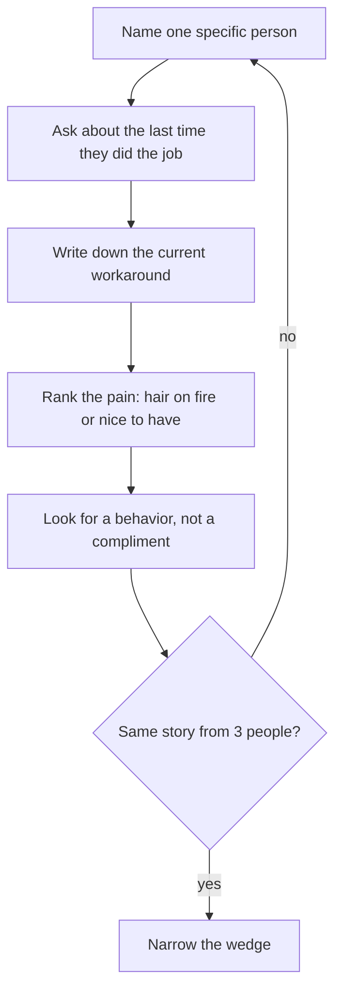

# Problem and customer
{: .no_toc }

*~8 min read*

## Why it matters

A startup is a bet that a specific person has a specific painful job, and that they will change their behavior if you make that job easier. Code does not test that bet. Conversations and watching people work do. Penn builders are good at shipping; the failure mode is shipping a polished thing for a user who exists only in a group chat.

If you are joining an early company rather than founding one, this is still week-one work. Sit in on real customer calls before you form an opinion about the roadmap.

## Core concepts

- **A customer is a person with a job, a budget, and a current workaround** — not a demographic ("college students") and not a persona slide. Name them so narrowly that you could text ten of them today: "Penn club treasurers who reconcile dues in a spreadsheet every Sunday."
- **The problem is what they already do, badly.** Ask how they get the job done now, how often, what it costs in time or money, and what they tried last. A problem that has no current workaround is often a problem nobody feels yet.
- **Pain has a rank.** "Hair on fire" means they are already spending money or hours and would switch this month. "Nice to have" means they nod, take a demo, and go back to the spreadsheet. You want the first.
- **You are not allowed to pitch in the first conversations.** The moment you describe your solution, people get polite. Polite feedback is how student projects die. Describe the situation, then shut up.
- **Behavior beats compliments.** A calendar hold, a forwarded intro, a login the next day, or a credit card are evidence. "I would definitely use that" is not.
- **Write the problem in their words, not yours.** If you cannot say it back and have them say "yes, that's it," you do not have the problem yet. See [Idea → wedge](../02-idea-wedge/) only after that sentence exists.

## What to do next

- [ ] Write one sentence: who, what job, how often, current workaround. If you need the word "platform," rewrite it.
- [ ] List 15 real people who match. Not "users." Names, or at least roles you can reach this week (classmates, labmates, club officers, a former internship team, a founder you can ask for an intro).
- [ ] Book 5 conversations of 20–25 minutes. Goal: learn the workflow, not recruit.
- [ ] Ask only past-tense questions: "Walk me through the last time you did X." "What did you try?" "What did that cost?" "Who else feels this?" Do not ask "would you use an app that…"
- [ ] After each call, write three lines the same day: the quote, the workaround, and whether they asked to see something.
- [ ] Stop when the same workaround shows up in 3 conversations, or when it doesn't show up at all. Both are answers. Then go to [MVP scope](../03-mvp-scope/).

## Mental model

You are collecting repeated stories, not votes on your idea.

## Common failure modes

- **Interviewing friends who want you to succeed.** They will not tell you the workaround is "I don't care." Talk to people who already feel the pain and don't owe you kindness.
- **Pitching the solution to "validate" it.** You contaminated the data. The only honest signal left is whether they do something next.
- **A huge TAM slide instead of ten names.** Market size is a later conversation. This week the market is a list.
- **Summarizing calls from memory a week later.** The useful detail (the exact spreadsheet, the exact person who blocks the purchase) is gone by then.

## Watch

- [How To Talk To Users \| Startup School](https://www.youtube.com/watch?v=z1iF1c8w5Lg) — Gustaf Alströmer, Y Combinator. Who to talk to, which questions to ask, and which questions ruin the conversation.
- [Lecture 16 - How to Run a User Interview (Emmett Shear)](https://www.youtube.com/watch?v=qAws7eXItMk) — YC Root Access, Stanford CS183B. How to run the conversation so you learn the workflow instead of collecting compliments.
- [Lecture 4 - Building Product, Talking to Users, and Growing (Adora Cheung)](https://www.youtube.com/watch?v=yP176MBG9Tk) — YC Root Access. Product, user conversations, and growth as one loop, from a founder who did the unglamorous version.

## Further reading

- Rob Fitzpatrick, *The Mom Test* — the short book on questions that even your mom can't fake an answer to.
- [Do Things that Don't Scale](http://www.paulgraham.com/ds.html) — Paul Graham. The early "customer" relationship is manual on purpose.
