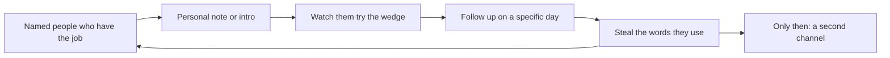

# Distribution and early GTM
{: .no_toc }

*~8 min read*

## Why it matters

Distribution is how a specific person finds out you exist and tries the wedge. Early on that is not a brand and not ads. It is a founder going where those people already are and doing an unscalable thing repeatedly. Technical teams over-build because building is in their control, and under-distribute because hearing "no" is not. If you cannot describe this week's distribution activity as a number of conversations, posts, emails, or demos, you do not have a go-to-market. You have a hope.

The message comes from [Problem & customer](../01-problem-customer/). If you skipped that, distribution just spreads a vague pitch faster.

## Core concepts

- **The first ten users have names.** You already listed them. Go-to-market at this stage is finishing that list: a personal note, a demo on their machine, you sitting next to them while they try it. Scale comes after ten people have the habit.
- **Do the thing that will not scale, on purpose.** Recruit in a group chat you are actually in. Concierge the setup. Stand in the place the workflow happens (the club office, the lab, the Discord). A channel you cannot name is not a channel.
- **Go where the workaround already lives.** If they live in a spreadsheet shared on email, email works. If they live in a Slack community, show up there as a person, not as a growth hack. Match the channel to their day, not to what is fashionable.
- **Founder-led sales is normal for B2B, even a tiny B2B.** One person, one problem, one ask: 20 minutes to watch the workflow. You are not "doing sales" as a department. You are the department. A CRM can be a spreadsheet until the spreadsheet hurts.
- **Cold outreach works when it is specific.** One sentence that proves you understand their last painful episode, then a small ask. A paragraph about your vision goes in the trash. Volume without specificity is spam.
- **A launch is a spike, not a strategy.** Posting once (demo day, a class Slack, a forum) is useful if you capture the people who show up and talk to them. It is not a substitute for the weekly motion. See the shipping cadence in [Build vs buy](../04-build-buy-shipping/).
- **Don't buy ads yet.** Ads scale a message that already converts. You do not know that message until strangers repeat it back. Spending money here hides the fact that the pitch is fuzzy.

## What to do next

- [ ] Pick one channel you can actually access this week. Write it down. Ignore every other channel until it produces a user or a clear no.
- [ ] Set a weekly quota that is behavior, not vibes: for example 10 personal notes, or 5 demos, or 3 on-site sittings. Track it next to the ship ritual.
- [ ] Write a 4-line outreach note: who you are, the specific job, one proof you understand the workaround, the ask (20 minutes or "try this link"). No deck.
- [ ] For every person who tries the product, schedule the follow-up before you hang up. "I'll check in Friday" is distribution too.
- [ ] Write down the sentence users use when they describe you to someone else. That sentence replaces your pitch. If they can't say it, the wedge is still muddy — return to [Idea → wedge](../02-idea-wedge/).
- [ ] Only after a stranger has successfully finished the job without you in the room should you consider a second channel.

## Mental model

Early GTM is a loop you can count, not a funnel diagram with six stages.

## Common failure modes

- **"We'll launch when it's ready."** Ready is how distribution gets postponed until the semester ends. A narrow thing in front of five people beats a launch to nobody.
- **Spraying five channels.** Each channel takes a repeated motion to learn. Five channels means you learned zero.
- **Hiding behind content or waiting for virality.** A blog post is fine if the people with the problem will see it. It is not a personality substitute for asking.
- **Treating a classmate's "I'll share it" as distribution.** Intros you do not follow up on are not a channel. You send the note.

## Watch

- [How to Get Your First Customers \| Startup School](https://www.youtube.com/watch?v=hyYCn_kAngI) — Y Combinator. How early teams actually got the first users, without pretending there is a hack.
- [The Best Way To Launch Your Startup \| Startup School](https://www.youtube.com/watch?v=u36A-YTxiOw) — Y Combinator. Launch as something you do repeatedly and learn from, not a single announcement.
- [How To Convert Customers With Cold Emails \| Startup School](https://www.youtube.com/watch?v=7Kh_fpxP1yY) — Y Combinator. When the people you need are not in your group chat, how a specific email is different from a blast.

## Further reading

- [Do Things that Don't Scale](http://www.paulgraham.com/ds.html) — Paul Graham. Still the right essay. Read it as a to-do list.
- [Startup Growth](http://www.paulgraham.com/growth.html) — Paul Graham. Useful *after* you have a weekly motion. Growth rate is meaningless if the base is zero because you never asked anyone.
