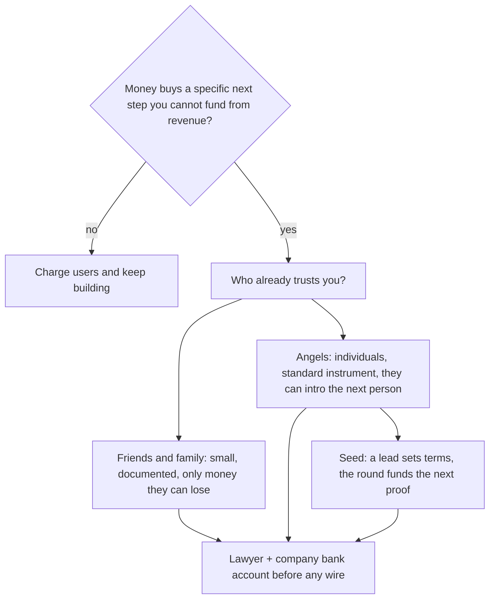

# Fundraising map
{: .no_toc }

*~9 min read*

## Why it matters

Fundraising is a tool for buying time and sometimes distribution, not a milestone that means the company is real. The real milestones are a user who finishes the job and cash that is not someone else's. This page is a map of *who* writes checks at the beginning — friends and family, angels, seed funds — and what each one is actually buying. It is not a term-sheet clinic and not advice to raise.

If you are joining early, use the map to decode what "we're raising" means for your offer. A round that is "almost closed" is not closed.

## Core concepts

- **Default is not "raise."** Many good student and small-business projects should charge customers and stay small. Raise when more money clearly creates more learning or a step you cannot take from revenue (a hire you have already justified, a regulated setup, hardware). If you cannot say what the money is for in one sentence tied to [runway](../08-runway-unit-economics/), you are raising because it feels like progress.
- **Friends and family** are people who trust *you*, often before the product deserves a stranger's money. The rule: only people who can afford to lose the check, in writing, through the company, with a lawyer. Do not take rent money from a relative because a tweet said to "raise a pre-seed." Document it. A casual Venmo is how you hurt someone and mess up the cap table.
- **Angels** are individuals investing their own money, usually on a standard instrument (in US venture, often a SAFE or a small priced round) because they believe in the team and a narrow insight. They decide faster than funds and can be wrong in either direction. One helpful angel who will take your call beats five logos. Ask who else they think should see it; intros are the product.
- **Seed** is the first institutional round: a lead fund (or a strong lead angel) sets terms, others fill. They are underwriting a team that can get to the *next* proof, not a finished company. Traction helps. A clear wedge and evidence you can recruit users helps. A 40-page deck does not. Process: a target list, a tight narrative ([Pitch](../13-pitch-narrative/)), many conversations in a short window so you are not lingering for a semester.
- **The instrument is a lawyer conversation.** You will hear "SAFE," "cap," "discount," "priced round." Know the words so you are not lost: a cap is a ceiling used later when price is set; a priced round sets a price now and sells shares. Do not invent terms, and do not sign what a stranger emails you. Standard documents exist so you don't negotiate from scratch.
- **Dilution is the cost.** You sell a slice of the company for cash and, if you chose well, help. Raising more than you need at a fuzzy valuation is not a win. Know roughly how much runway the round adds after you hire the thing you said you would hire.
- **Time cost is the hidden burn.** A founder in meetings for eight weeks is a founder not shipping. Time-box the raise. If the round isn't happening, go back to users. The company that doesn't need the money has the only real leverage.

## What to do next

- [ ] Write one sentence: "We are raising / not raising because ____, and the money would buy ____ months of ____." If the blank is "optionality," don't raise this month.
- [ ] If you are raising, pick the rung that matches reality: people who know you (friends and family, carefully), angels who understand this user, or a seed lead. Don't skip to funds because they sound serious.
- [ ] Build a list of 20 names you can reach through a real intro. Note who introduces you. Warm beats cold by a lot; cold is allowed when the note is specific.
- [ ] Put the legal work in calendar *before* the first check: company exists ([Incorporation](../09-incorporation-high-level/)), a lawyer has seen the instrument, you know how the money hits the bank account.
- [ ] Run the process in a batch (a few weeks), update people when you have news, and keep shipping on the same weekly cadence. Fundraising does not pause [distribution](../05-distribution-gtm/).
- [ ] If you are joining: ask what is signed, what is wired, and what runway is *today*. Believe the bank balance.

## Mental model

Each rung is a kind of person, not a trophy. Skip a rung only when the story is already strong enough for the next person.

## Common failure modes

- **Raising instead of selling.** Investor interest is not a user. A term sheet does not activate a cohort. Keep the weekly user quota or the round becomes the product.
- **Taking money from someone who cannot afford the loss.** This is the failure mode that hurts real families. If they hesitate about the amount, the amount is wrong.
- **A perpetual raise.** "We're always fundraising" means the company is always in pitch mode. Batch it, then stop and work.
- **Custom terms you don't understand.** A weird side letter to "be founder friendly" can be the opposite. Boring and lawyer-read beats clever.

## Watch

- [How Startup Fundraising Works \| Startup School](https://www.youtube.com/watch?v=zBUhQPPS9AY) — Brad Flora, Y Combinator. The myths (you must raise to start, you need a fancy network, a no means the company is bad) and how the process actually feels.
- [Fundraising Fundamentals By Geoff Ralston](https://www.youtube.com/watch?v=gcevHkNGrWQ) — Y Combinator. Who is in the ecosystem, how much to raise, and how to run the meetings without forgetting to go back to work.
- [Lecture 9 - How to Raise Money (Marc Andreessen, Ron Conway, Parker Conrad)](https://www.youtube.com/watch?v=uFX95HahaUs) — YC Root Access. A seed-stage panel: what investors are actually underwriting, and the relationship between risk and how much cash you hold.

## Further reading

- [A Guide to Seed Fundraising](https://www.ycombinator.com/library/4A-a-guide-to-seed-fundraising) — Geoff Ralston, Y Combinator. The written map. Read it before you invent a process.
- [How to Raise Money](http://www.paulgraham.com/fundraising.html) — Paul Graham. Older, still right about the psychology: the raise is a distraction you finish so you can work.
- [How to Fund a Startup](http://www.paulgraham.com/startupfunding.html) — Paul Graham. Why the money exists at all.
