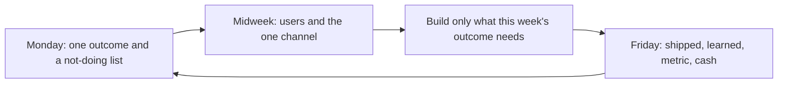

# Weekly operating cadence
{: .no_toc }

*~8 min read*

## Why it matters

Early companies don't fail in a dramatic strategic moment. They fail in weeks where nobody can say what was supposed to happen, what shipped, or who talked to a user. A cadence is a short, repeating meeting with yourself (and your cofounder, if you have one) that forces those three facts into the open. It is not a planning framework and not OKRs for a 200-person company. It is how two people stay honest.

Every earlier page dumps into this one: the user quota, the ship, the price conversations, the metric, the cash.

## Core concepts

- **One primary outcome for the week.** Not a theme. A result you can point at on Friday: "two treasurers finished a reconciliation" or "price said out loud on three calls" or "runway spreadsheet updated and one cost cut." If everything is the priority, the semester is the priority and nothing finishes.
- **A written plan before Monday gets noisy.** A few lines: the outcome, the two or three tasks that cause it, who owns each, what you are explicitly not doing. This replaces a backlog tool until the backlog tool would save you time, which is later.
- **Midweek is for the outside world.** Block time for user conversations and for the one distribution motion. Building all week and "doing outreach Friday" means outreach dies every time the build slips. See [Distribution](../05-distribution-gtm/).
- **Friday is a review, not a status performance.** What shipped that a user could touch. What you learned (a quote, a number). The primary metric and cash, even if they're ugly. What you will stop. Then the next week's one outcome. Thirty minutes. Standing up is fine. A slide deck is not.
- **Write it where the other person will see it.** A shared doc, dated, one section per week. Memory is kind; the doc is not. When you disagree, you are disagreeing with last Friday's words, which is a better fight than a vibe.
- **The cadence survives fundraising, exams, and "crazy weeks."** Those are the weeks it exists for. Shrink it (15 minutes, three lines) rather than skipping it. Skipping is how a two-week slip becomes "we should regroup next month."
- **If you are an early hire,** ask to be in the review or to read the doc. A company that will not show you the weekly truth is telling you there isn't one. If you are a founder, the first hire should see the ritual in week one so they learn that shipping and users are the culture, not the all-hands speech.

## What to do next

- [ ] Create one running doc titled "Weekly." Add this week's date, the one outcome, and the not-doing list. Share it with your cofounder tonight.
- [ ] Put two recurring holds on the calendar: a Monday 20-minute plan, a Friday 30-minute review. Protect the user-conversation block on a midweek day the same way.
- [ ] Friday template, copy it every week: shipped (user-visible), learned (quote or number), metric ([activation / retention / revenue](../07-metrics-that-matter/)), cash and months of runway, stop-doing, next outcome.
- [ ] Run it for four weeks before you change the template. The point is repetition. A new productivity system is procrastination.
- [ ] If you miss the outcome, write why in one line (scope, fear of talking to users, a class deadline) and cut next week's outcome in half. Do not write a longer plan.
- [ ] Once a month, reread the four Fridays. The pattern — always shipping, never learning, or the reverse — is the actual strategy review.

## Mental model

The week is a loop with a written residue. Strategy is what the residue says you keep repeating.

## Common failure modes

- **A goal list with eight items.** That is a wish list. Force a single outcome or the review becomes "we were busy."
- **Reviewing effort instead of evidence.** "Worked hard on onboarding" is not a Friday line. "One user finished, two got stuck on the import" is.
- **Tools instead of the meeting.** You do not need a new app to write six lines. Adopt a tool when the doc actually hurts.
- **Cadence as performance.** Sanitized updates that hide a bad cohort or a scary runway date defeat the point. The doc is for the people doing the work. Be blunt in it.

## Watch

- [Setting KPIs and Goals \| Startup School](https://www.youtube.com/watch?v=6DTK9yDP6p0) — Y Combinator. How early teams pick a primary metric and set a target without drowning in secondary numbers. Use it to choose the one outcome, then come back to the Friday template.
- [Lecture 14 - How to Operate (Keith Rabois)](https://www.youtube.com/watch?v=6fQHLK1aIBs) — YC Root Access. Operating cadence as the company gets slightly less tiny: what you track, what you edit, and how information moves. Steal the "write it down" discipline now; ignore the parts that assume a larger team.

## Further reading

- [Default Alive or Default Dead](http://paulgraham.com/aord.html) — Paul Graham. Put the binary in the Friday doc once a month so it cannot hide.
- Re-read [Build vs buy & shipping cadence](../04-build-buy-shipping/) if the Friday "shipped" line is empty for two weeks. The fix is a smaller spec, not a motivational quote.
