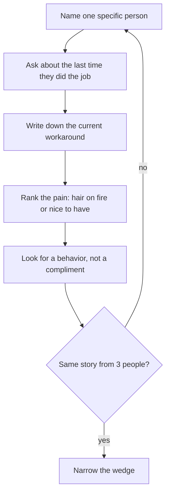

# 問題與客戶
{: .no_toc }

*約 8 分鐘*

## 為什麼重要

新創是一場賭注：某個具體的人有一件具體、痛苦的工作，而你若讓那件工作變容易，他們會改變行為。程式碼測不了這個賭注。對話、以及看他們怎麼做事，才測得到。技術背景的 builder 很會 ship；失敗模式是做出一份很精緻的東西，給一個只存在於群聊裡的用戶。

如果你是加入早期公司而不是創辦，這仍然是第一週的工作。先坐進真正的客戶通話，再對 roadmap 形成意見。

## 核心概念

- **客戶是一個有工作、有預算、有現成替代做法的人**——不是一個人口統計（「大學生」），也不是一張 persona 投影片。窄到今天就能傳訊給其中十個：「每個星期天用試算表對帳會費的社團財務長。」
- **問題是他們已經在做、而且做得不好的事。** 問他們現在怎麼把這件工作做完、多常做、時間或錢花多少、上次試過什麼。一個沒有現成替代做法的問題，常常是還沒人真正感覺到的問題。
- **痛有排序。** 「火燒眉毛」代表他們已經在花錢或花時間，而且這個月就會換。 「有也不錯」代表他們點頭、看 demo，然後回到試算表。你要的是前者。
- **前幾次對話不准 pitch。** 你一講解法，人就開始客氣。客氣的回饋是學生專案死掉的方式。描述情境，然後閉嘴。
- **行為勝過稱讚。** 行事曆上的時段、轉介、隔天登入、或一張信用卡，才是證據。「我一定會用」不是。
- **用他們的話寫問題，不是你的。** 如果你講回去，他們不能說「對，就是這個」，你還沒抓到問題。那句話存在之後，才去看[點子 → wedge](../02-idea-wedge/)。

## 接下來做什麼

- [ ] 寫一句：誰、什麼工作、多常、現成替代做法。如果需要用到「platform」這個字，重寫。
- [ ] 列出 15 個符合的真人。不是「用戶」。名字，或至少是這週能聯絡到的角色（同學、實驗室同伴、社團幹部、以前實習的團隊、可以請他介紹的創辦人）。
- [ ] 約 5 場 20–25 分鐘的對話。目標：搞懂 workflow，不是招募。
- [ ] 只問過去式：「帶我走一次你上次做 X。」「你試過什麼？」「那花了多少？」「還有誰有這種感覺？」不要問「如果有一個 app 能……你會用嗎」。
- [ ] 每次通話當天寫三行：原話、替代做法、以及他們有沒有主動要看東西。
- [ ] 同一個替代做法在 3 場對話出現，或完全沒出現，就停。兩邊都是答案。然後去[MVP 範圍](../03-mvp-scope/)。

## 心智模型

你在蒐集重複出現的故事，不是對你的點子投票。

## 常見失敗模式

- **訪談想讓你成功的朋友。** 他們不會告訴你替代做法是「我根本不在乎」。找已經感到痛、而且不欠你人情的人談。
- **用 pitch 解法來「驗證」它。** 你污染了資料。剩下唯一誠實的訊號，是他們接下來有沒有真的做一件事。
- **一張巨大的 TAM 投影片，而不是十個名字。** 市場規模是之後的對話。這週的市場是一份名單。
- **一週後靠記憶摘要通話。** 有用的細節（那份試算表、擋住採購的那個人）那時已經沒了。

## 觀看

- [How To Talk To Users \| Startup School](https://www.youtube.com/watch?v=z1iF1c8w5Lg) — Gustaf Alströmer, Y Combinator。找誰談、該問哪些問題、以及哪些問題會毀掉對話。
- [Lecture 16 - How to Run a User Interview (Emmett Shear)](https://www.youtube.com/watch?v=qAws7eXItMk) — YC Root Access, Stanford CS183B。怎麼把對話跑成你在學 workflow，而不是在蒐集稱讚。
- [Lecture 4 - Building Product, Talking to Users, and Growing (Adora Cheung)](https://www.youtube.com/watch?v=yP176MBG9Tk) — YC Root Access。產品、用戶對話、成長是同一個迴圈，來自一個做過不華麗版本的創辦人。

## 延伸閱讀

- Rob Fitzpatrick, *The Mom Test* —— 短書，講連你媽都裝不出答案的那種問題。
- [Do Things that Don't Scale](http://www.paulgraham.com/ds.html) — Paul Graham。早期的「客戶」關係，本來就該是手動的。
