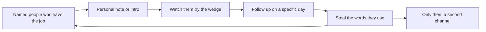

# 通路與早期 GTM
{: .no_toc }

*約 8 分鐘*

## 為什麼重要

通路是某個具體的人怎麼發現你存在、並試那個 wedge。早期那不是品牌，也不是廣告。那是創辦人走到那些人已經在的地方，反覆做一件無法 scale 的事。技術團隊會過度建造，因為建造在自己掌控裡；會通路不足，因為聽到「不」不在掌控裡。如果你沒辦法把這週的通路活動講成對話、貼文、email 或 demo 的次數，你沒有 go-to-market。你有一個希望。

訊息來自[問題與客戶](../01-problem-customer/)。如果你跳過那頁，通路只是把模糊的 pitch 傳得更快。

## 核心概念

- **前十個用戶有名字。** 你已經列過了。這個階段的 go-to-market 就是把那份名單做完：一則私人訊息、在他們機器上的 demo、你坐在旁邊看他們試。Scale 發生在十個人養成習慣之後。
- **刻意做無法 scale 的事。** 在你真的在的群聊裡招募。Concierge 安裝。站在 workflow 發生的地方（社團辦公室、實驗室、Discord）。你叫不出名字的 channel 不是 channel。
- **去替代做法已經住的地方。** 如果他們活在 email 分享的試算表裡，email 就有用。如果他們活在 Slack 社群，以一個人的身分出現，不是以 growth hack 出現。把 channel 對準他們的一天，不是對準流行什麼。
- **Founder-led sales 對 B2B 是正常的，即使是很小的 B2B。** 一個人、一個問題、一個請求：20 分鐘看 workflow。你不是在當一個「業務部門」。你就是那個部門。CRM 在試算表痛之前可以是試算表。
- **Cold outreach 在夠具體時有用。** 一句證明你懂他們上次痛苦情節的話，然後一個小請求。一段講願景的段落會進垃圾桶。沒有具體性的量是 spam。
- **Launch 是尖峰，不是策略。** 貼一次（demo day、課堂 Slack、論壇）有用，前提是你抓住出現的人並跟他們談。它不能替代每週的動作。見[Build vs buy](../04-build-buy-shipping/)裡的出貨節奏。
- **先別買廣告。** 廣告放大的是已經會轉換的訊息。在陌生人把話講回來之前，你不知道那個訊息。這裡花錢，只是把 pitch 還很糊這件事藏起來。

## 接下來做什麼

- [ ] 選一個這週你真的進得去的 channel。寫下來。在它產出一個用戶或一個清楚的 no 之前，忽略其他所有 channel。
- [ ] 設一個行為配額，不是氣氛：例如 10 則私人訊息、或 5 場 demo、或 3 次現場坐陪。跟 ship 儀式放在一起追。
- [ ] 寫一則 4 行 outreach：你是誰、那件具體工作、一個你懂替代做法的證明、請求（20 分鐘或「試這個連結」）。不要 deck。
- [ ] 每個試過產品的人，掛電話前先把 follow-up 排進行事曆。「週五我再 check in」也是通路。
- [ ] 寫下用戶跟別人形容你時用的那句話。那句話取代你的 pitch。如果他們講不出來，wedge 還是泥巴——回到[點子 → wedge](../02-idea-wedge/)。
- [ ] 只有在一個陌生人沒有你在場也成功做完那件工作之後，才考慮第二個 channel。

## 心智模型

早期 GTM 是一個你數得出來的迴圈，不是一張有六個階段的漏斗圖。

## 常見失敗模式

- **「好了再 launch。」** Ready 是通路被拖到學期結束的方式。五個人面前的窄東西，勝過對沒有人的 launch。
- **噴五個 channel。** 每個 channel 都需要重複的動作才學得會。五個 channel 代表你學了零個。
- **躲在內容後面，或等病毒。** 有這個問題的人會看到的話，blog 沒問題。它不能替代開口問。
- **把同學的「我會分享」當成通路。** 你沒有 follow-up 的介紹不是 channel。你去傳那則訊息。

## 觀看

- [How to Get Your First Customers \| Startup School](https://www.youtube.com/watch?v=hyYCn_kAngI) — Y Combinator。早期團隊實際上怎麼拿到第一批用戶，不假裝有捷徑。
- [The Best Way To Launch Your Startup \| Startup School](https://www.youtube.com/watch?v=u36A-YTxiOw) — Y Combinator。Launch 是你反覆做、從中學習的事，不是一次公告。
- [How To Convert Customers With Cold Emails \| Startup School](https://www.youtube.com/watch?v=7Kh_fpxP1yY) — Y Combinator。當你需要的人不在你的群聊裡，一封具體的 email 跟一場群發有什麼不同。

## 延伸閱讀

- [Do Things that Don't Scale](http://www.paulgraham.com/ds.html) — Paul Graham。仍然是對的那篇。當成待辦清單讀。
- [Startup Growth](http://www.paulgraham.com/growth.html) — Paul Graham。在你有每週動作*之後*才有用。基數是零——因為你從沒問過人——的話，成長率沒有意義。
