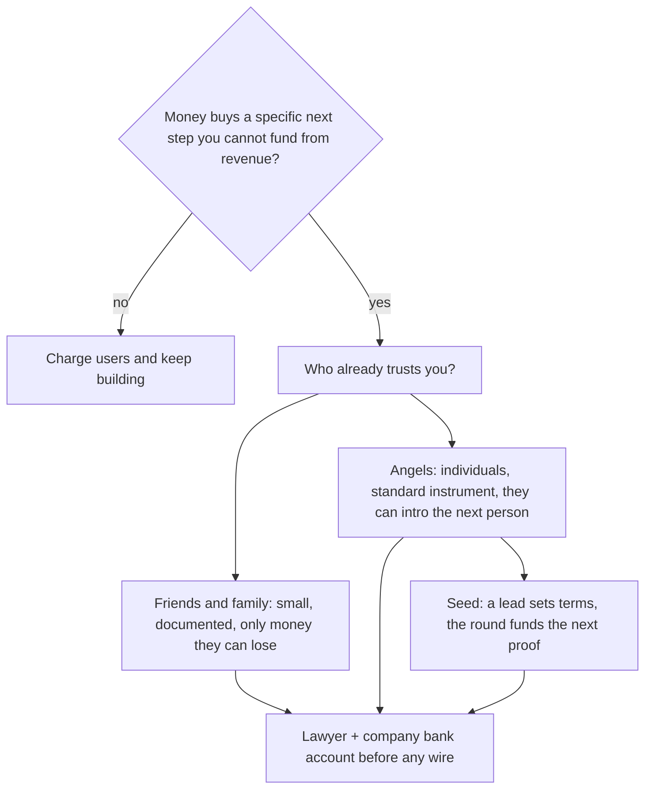

# 募資地圖
{: .no_toc }

*約 9 分鐘*

## 為什麼重要

募資是買時間、有時買通路的工具，不是代表公司是真的那個里程碑。真正的里程碑是一個做完那件工作的用戶，以及不是別人的現金。這一頁是地圖：一開始*誰*開支票——friends and family、天使、seed 基金——以及每一種人實際上在買什麼。這不是 term-sheet 診所，也不是叫你去募的建議。

如果你早期加入，用這張地圖解碼「我們在募」對你的 offer 意味什麼。「快 close 了」的一輪還沒 close。

## 核心概念

- **預設不是「去募」。** 很多好的學生和小型生意專案應該向客戶收費、保持小。在更多錢明顯創造更多學習、或跨出營收跨不出的那一步時才募（一個你已經能正當化的招募、受監管的設置、硬體）。如果你不能用一句話、綁在[runway](../08-runway-unit-economics/)上說這筆錢是幹嘛的，你是因為感覺像進度才在募。
- **Friends and family** 是信任*你*的人，常常在產品還配不上陌生人的錢之前。規則：只收寫得下損失、透過公司、經律師、付得起輸掉這張支票的人。不要因為一則推文說「募 pre-seed」就拿親戚的房租錢。做成文件。隨手 Venmo 是你傷害某個人、並把 cap table 搞砸的方式。
- **天使** 是用自己的錢投資的個人，通常走標準工具（在美國 venture，常常是 SAFE 或小型 priced round），因為他們相信團隊和一個窄洞察。他們比基金決定快，兩個方向都可能錯。一個會接你電話的有用天使，勝過五個 logo。問他們覺得還該給誰看；介紹才是產品。
- **Seed** 是第一輪機構輪：一個 lead 基金（或很強的 lead 天使）定條款，其他人填滿。他們在承保的是能走到*下一個*證明的團隊，不是做完的公司。Traction 有幫助。清楚的 wedge、以及你能招募用戶的證據有幫助。40 頁 deck 沒有。流程：一份目標名單、緊的敘事（[Pitch](../13-pitch-narrative/)）、在短窗口裡很多對話，這樣你才不會拖一學期。
- **工具是律師對話。** 你會聽到「SAFE」、「cap」、「discount」、「priced round」。認得這些字，才不會迷路：cap 是之後定價時用的天花板；priced round 現在定價並賣股份。不要發明條款，也不要簽陌生人寄來的東西。標準文件存在，是為了讓你不用從零談。
- **Dilution 是代價。** 你賣一塊公司換現金，以及——如果選得好——幫忙。在模糊估值上募超過你需要的，不是贏。大概知道這一輪在你招了你說要招的人之後，加了多少 runway。
- **時間成本是隱藏的 burn。** 創辦人開八週會，就是創辦人沒在 ship。把募資限時。如果這一輪沒在發生，回到用戶。不需要這筆錢的公司，才有唯一真正的槓桿。

## 接下來做什麼

- [ ] 寫一句：「我們募 / 不募是因為 ____，這筆錢會買 ____ 個月的 ____。」如果空白是「optionality」，這個月不要募。
- [ ] 如果在募，選符合現實的那一階：認識你的人（friends and family，小心）、懂這個用戶的天使、或 seed lead。不要因為基金聽起來認真就跳過去。
- [ ] 建一份你能透過真正介紹碰到的 20 個名字。記下誰介紹你。Warm 大幅勝過 cold；note 夠具體時 cold 也可以。
- [ ] 在第一張支票之前，把法律工作放進行事曆：公司存在（[Incorporation](../09-incorporation-high-level/)）、律師看過工具、你知道錢怎麼進銀行帳戶。
- [ ] 用一批（幾週）跑流程，有消息就更新大家，並在同一套每週節奏上繼續 ship。募資不暫停[通路](../05-distribution-gtm/)。
- [ ] 如果你是加入：問什麼簽了、什麼打進來了、以及*今天*的 runway 是多少。相信銀行餘額。

## 心智模型

每一階是一種人，不是獎盃。只有故事已經強到夠給下一個人聽時，才跳階。

## 常見失敗模式

- **募資取代銷售。** 投資人興趣不是用戶。Term sheet 不會 activate 一個 cohort。維持每週用戶配額，否則這一輪會變成產品。
- **拿付不起損失的人的錢。** 這是會傷害真實家庭的失敗模式。如果他們對金額猶豫，金額就是錯的。
- **永遠在募。** 「我們一直在募資」代表公司一直處於 pitch 模式。一批一批做，然後停下來幹活。
- **你不懂的客製條款。** 一封「對創辦人友善」的奇怪 side letter 可能正好相反。無聊、律師讀過，勝過聰明。

## 觀看

- [How Startup Fundraising Works \| Startup School](https://www.youtube.com/watch?v=zBUhQPPS9AY) — Brad Flora, Y Combinator。那些迷思（必須募才能開始、需要華麗人脈、一個 no 代表公司不好）以及流程實際的感覺。
- [Fundraising Fundamentals By Geoff Ralston](https://www.youtube.com/watch?v=gcevHkNGrWQ) — Y Combinator。生態系裡有誰、募多少、以及怎麼開會才不會忘了回去幹活。
- [Lecture 9 - How to Raise Money (Marc Andreessen, Ron Conway, Parker Conrad)](https://www.youtube.com/watch?v=uFX95HahaUs) — YC Root Access。一場 seed 階段的 panel：投資人實際在承保什麼，以及風險和你手上現金的關係。

## 延伸閱讀

- [A Guide to Seed Fundraising](https://www.ycombinator.com/library/4A-a-guide-to-seed-fundraising) — Geoff Ralston, Y Combinator。書面地圖。在你發明一套流程之前讀。
- [How to Raise Money](http://www.paulgraham.com/fundraising.html) — Paul Graham。比較舊，對心理仍然對：募資是你完成好去幹活的干擾。
- [How to Fund a Startup](http://www.paulgraham.com/startupfunding.html) — Paul Graham。這筆錢究竟為什麼存在。
