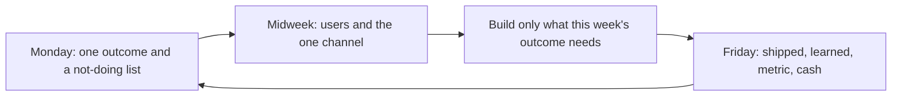

# 每週營運節奏
{: .no_toc }

*約 8 分鐘*

## 為什麼重要

早期公司不是在一個戲劇性的策略時刻失敗。它們失敗在沒人講得出來這一週該發生什麼、ship 了什麼、或誰跟用戶談過的那些週。節奏是一場短、重複、跟你自己（以及 cofounder，如果你有）的會議，逼這三件事公開。它不是規劃框架，也不是 200 人公司的 OKR。它是兩個人怎麼保持誠實。

前面每一頁都倒進這一頁：用戶配額、ship、價格對話、指標、現金。

## 核心概念

- **這一週一個主結果。** 不是主題。週五你指得出來的結果：「兩個財務長做完一次對帳」或「三通通話當場講出價格」或「runway 試算表更新完並砍了一筆成本」。如果每件事都是優先，學期就是優先，什麼都做不完。
- **週一變吵之前先有書面計畫。** 幾行：結果、造成它的兩三件事、誰負責每一件、你明確不做什麼。這在 backlog 工具真的能省你時間之前取代它，那是之後的事。
- **週中給外面的世界。** 擋出時間給用戶對話、以及那一個通路動作。整週建造、「週五再做 outreach」代表建造一滑，outreach 就死。見[通路](../05-distribution-gtm/)。
- **週五是回顧，不是進度表演。** 用戶摸得到的 ship 了什麼。你學到什麼（一句原話、一個數字）。主指標和現金，即使難看。你要停什麼。然後下週的那一個結果。三十分鐘。站著沒問題。投影片不行。
- **寫在另一個人看得到的地方。** 一份共用文件、標日期、每週一節。記憶很善良；文件不善良。你們意見不合時，是在跟上週五的字吵架，那比跟氣氛吵更好。
- **節奏在募資、考試、和「瘋狂週」裡活下來。** 那些週就是它存在的理由。縮小它（15 分鐘、三行）而不是跳過。跳過是兩週滑變成「下個月再 regroup」的方式。
- **如果你是早期招募，** 要求進回顧或讀那份文件。一家不給你看每週真相的公司，是在告訴你沒有真相。如果你是創辦人，第一個招募第一週就該看到這個儀式，讓他們學會文化和出貨、用戶有關，不是和全員大會講稿有關。

## 接下來做什麼

- [ ] 建一份持續文件，標題「Weekly」。加上本週日期、那一個結果、以及不做清單。今晚跟 cofounder 分享。
- [ ] 在行事曆放兩個重複時段：週一 20 分鐘計畫、週五 30 分鐘回顧。用同樣方式保護週中某天的用戶對話時段。
- [ ] 週五模板，每週複製：shipped（用戶看得到）、學到（原話或數字）、指標（[activation / retention / 營收](../07-metrics-that-matter/)）、現金和幾個月 runway、停止做、下一個結果。
- [ ] 跑四週再改模板。重點是重複。一套新生產力系統是拖延。
- [ ] 如果錯過結果，用一行寫為什麼（範圍、怕跟用戶談、課堂截止）並把下週結果砍半。不要寫更長的計畫。
- [ ] 每個月重讀那四個週五。那個模式——永遠在 ship、從不學習，或反過來——才是真正的策略回顧。

## 心智模型

一週是帶書面殘留的迴圈。策略就是殘留說你一直在重複的事。

## 常見失敗模式

- **八項的目標清單。** 那是願望清單。強迫單一結果，否則回顧變成「我們很忙」。
- **回顧努力而不是證據。** 「onboarding 很認真做」不是週五行。「一個用戶做完，兩個卡在匯入」才是。
- **工具取代會議。** 寫六行不需要新 app。文件真的痛的時候再採用工具。
- **節奏當表演。** 把難看的 cohort 或嚇人的 runway 日期藏起來的消毒更新，打敗了重點。文件是給做這份工作的人。在裡面直言。

## 觀看

- [Setting KPIs and Goals \| Startup School](https://www.youtube.com/watch?v=6DTK9yDP6p0) — Y Combinator。早期團隊怎麼選主指標、設目標，而不被次數字淹死。用它選那一個結果，然後回到週五模板。
- [Lecture 14 - How to Operate (Keith Rabois)](https://www.youtube.com/watch?v=6fQHLK1aIBs) — YC Root Access。公司稍微不那麼小時的營運節奏：你追什麼、你改什麼、資訊怎麼流動。現在偷「寫下來」的紀律；忽略假設更大團隊的部分。

## 延伸閱讀

- [Default Alive or Default Dead](http://paulgraham.com/aord.html) — Paul Graham。每個月把那個二元放進週五文件一次，讓它藏不住。
- 如果週五「shipped」那行連續兩週是空的，重讀[Build vs buy 與出貨節奏](../04-build-buy-shipping/)。修法是更小的 spec，不是一句激勵。
